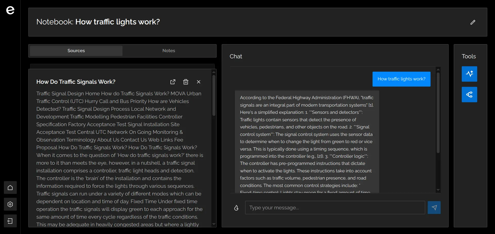

# Escruta

_"Think, ask, learn"_

**Escruta** is an open-source alternative to proprietary AI-powered research assistance platforms. **Escruta** aims to provide a robust and extensible solution for personal knowledge management and AI interaction.

## Features

**Escruta** is designed to be your study and research companion, allowing you to organize your sources, obtain instant information, and foster new ideas.

### Application Flow:

- **Notebook Creation**: Organize your projects and research by creating dedicated notebooks.
- **Source Management**: Upload your own documents (web pages, text files) for AI analysis.
- **AI Chat**: Interact with an AI that responds based exclusively on the sources in your notebook, ensuring accurate and relevant answers.
- **Integrated Note-Taking**: Take and save notes directly within your notebooks to consolidate your learning.

### Additional Featured Capabilities:

- **Audio Summary**: Generate audio summaries from your notebook sources, enabling comfortable and accessible information review.
- **Mind Map**: Visualize connections between topics in your sources with automatically generated mind maps for deeper understanding.

## Screenshots

## Tech Stack

**Escruta** is built on a robust architecture, using modern and widely adopted technologies to ensure scalability, performance, and ease of maintenance.

The **frontend** is developed with **Vite** and **React**. Navigation is managed with **React Router**, while **Tailwind CSS** provides utility styling. Animations are implemented with **Motion**.

In the **backend**, the application uses **Java** with **Spring Web** for RESTful APIs. Security is managed with **Spring Security** for authentication and data protection.

For data persistence, **PostgreSQL** is used.
