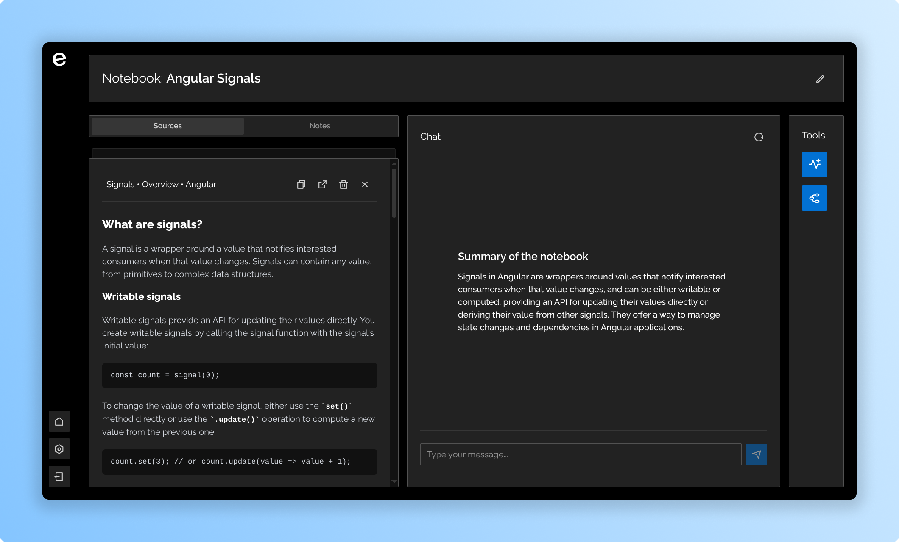

# Escruta

_"Think, ask, learn"_

**Escruta** is an open-source, AI-powered research assistant designed to streamline your personal knowledge management and learning workflow. It provides a private and extensible alternative to proprietary research platforms.

## Features

- **Centralized Notebooks**: Organize your research into distinct projects or topics. Each notebook acts as a self-contained workspace for your sources, notes, and AI conversations.
- **Source Management**: Upload and manage your documents. When you provide a web link, Escruta processes it into a clean, readable document for analysis. Escruta uses these materials as the sole knowledge base for its AI.
- **Context-Aware AI Chat**: Engage in a dialogue with an AI that understands your documents. Ask complex questions, clarify concepts, and get answers based only on the sources you've provided.
- **Integrated Note-Taking**: Capture your thoughts and summaries directly within your notebooks. Keep your insights connected to your source material.
- **Audio Summaries**: Listen to your knowledge. Generate and play audio summaries from your notebook's sources, perfect for on-the-go learning and revision.
- **Mind Maps**: Visualize the big picture. Automatically generate mind maps that illustrate the connections and hierarchies between topics in your sources.

## Technology Stack

The project is organized into three main directories: `frontend/`, `backend/` and `mobile/`.

- **Frontend**: Vite, React, React Router, Tailwind CSS, and Framer Motion.
- **Backend**: Java (with Spring Boot), Spring Web, Spring Security, and PostgreSQL.
- **Mobile**: React Native (with Expo).

## Getting Started

To get a local copy up and running, please follow the setup instructions in the `README.md` file within each directory: [`frontend`](frontend/README.md), [`backend`](backend/README.md), and [`mobile`](mobile/README.md).
