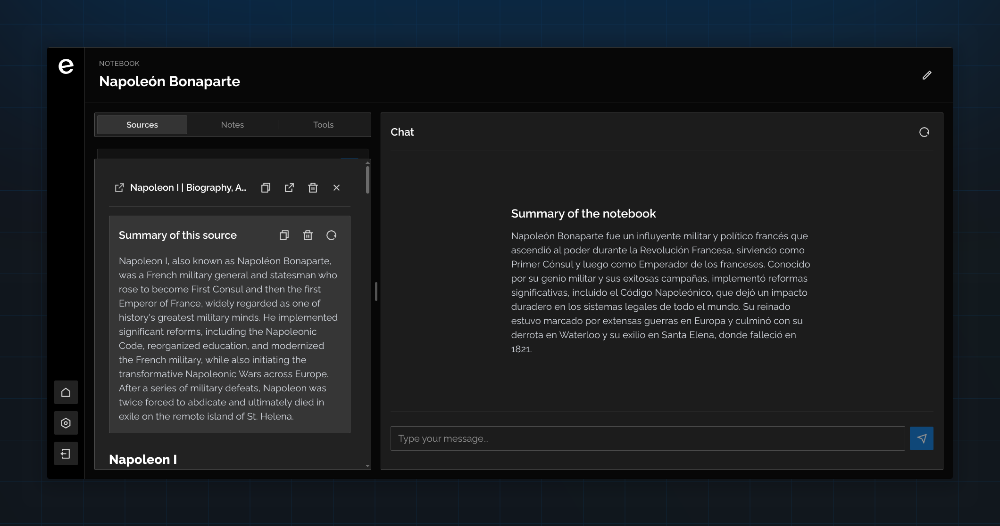

# Escruta Documentation

Escruta is an open-source platform powered by AI, created for researchers, students, and professionals in knowledge-intensive roles.

## What is Escruta?

Escruta is designed to help you organize, analyze, and extract insights from your research materials. Whether you're working on academic research, professional projects, or personal learning, Escruta provides powerful AI-driven tools to enhance your workflow.

## Key Features

- **Notebooks**: Organize your research into centralized project workspaces  
- **Sources**: Upload and manage documents, web links, and research materials
- **Notes**: Take intelligent notes with AI-powered assistance
- **AI Tools**: Generate summaries, mind maps, study guides, and flashcards

## Getting Started

Explore the features and get started with Escruta through the documentation provided in the sidebar. Each feature has its own dedicated page with detailed explanations and usage instructions.

## Open Source

Escruta is open-source and available on [GitHub](https://github.com/francids/escruta). We welcome contributions and feedback from the community.